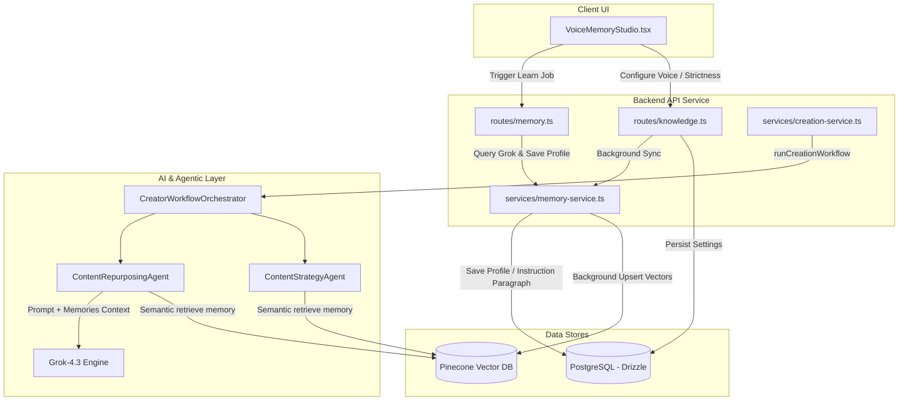

# Voice Memory & Consistency Architecture

This document describes the design, implementation, and workflow of the **Voice Memory** system in Narrativee. It explains how creator personalities, custom styles, and writing patterns are ingested, stored semantically, and applied during automated content repurposing.

---

## 1. High-Level Architecture

The Voice Memory system spans frontend configuration, background learning tasks, relational database storage, vector similarity storage, and an agentic orchestration layer.



---

## 2. Database Schema & Data Models

The system defines a user's knowledge base and voice preferences in the `knowledgeBase` table using Drizzle ORM.

### Postgres Schema (`knowledgeBase`)
Located in [schema.ts](file:///Users/user/Desktop/research/Narrativee_old/apps/backend/src/auth/schema/schema.ts):
* **`brandVoiceTraining` (text)**: A consolidated instruction paragraph (brand voice prompt rules) generated by Grok or entered manually by the user.
* **`voiceMemory` (jsonb)**: Stores ingested samples, structured profile attributes, and metadata.
* **`customHooks` (jsonb)**: Array of platform-specific hooks (`{ channel, hook }`).
* **`customTemplates` (jsonb)**: Array of templates (`{ channel, template }`).
* **`bannedWords` (jsonb)**: Array of terms the creator wants to avoid.

### Structure of the `voiceMemory` JSONB Payload
The `voiceMemory` field is structured as:
```typescript
interface VoiceMemory {
  sources: Array<{
    category: "newsletter" | "x" | "linkedin" | "website" | "best-performing";
    label?: string;
    content: string;
    url?: string | null;
  }>;
  profile: {
    tone: string;
    vocabulary: string;
    sentenceLength: string;
    humorLevel: string;
    opinionatedVsNeutral: string;
    ctaStyle: string;
    topicsToAvoid: string;
    frequentPhrases: string;
  };
  strictness: number;             // Voice strictness setting (0-100)
  status: "idle" | "learning" | "ready" | "failed";
  lastLearnedAt: string | null;
  lastLearnedSourceId: string | null;
}
```

---

## 3. Voice Extraction & Learning Flow (`/learn`)

The `/learn` endpoint in [routes/memory.ts](file:///Users/user/Desktop/research/Narrativee_old/apps/backend/src/routes/memory.ts) automates voice extraction by parsing existing content (e.g., newsletters) to populate the voice profile.

1. **Corpus Construction**:
   * Collects up to 6 recent articles associated with the selected `sourceId`.
   * Appends manually pasted source snippets from the database.
   * Cleans white spaces and truncates each article/source to 2,000 characters to form a unified training corpus.
2. **Grok Ingestion**:
   * The corpus is sent to Grok-4.3 (truncated to 18,000 characters) with a strict system prompt instructing the model to return a JSON containing:
     * `brandVoiceTraining`: A high-level system rule paragraph summarizing writing pacing, tone, and conventions.
     * `profile`: Structured keys for `tone`, `vocabulary`, `sentenceLength`, etc.
3. **Deterministic Fallback**:
   * If `GROK_API_KEY` is not found or the request fails, the backend builds a fallback static voice profile based on simple content excerpts:
     * `tone`: `"Direct and creator-first"`
     * `vocabulary`: `"Clear, practical, low-jargon"`
     * `sentenceLength`: `"Mostly short with occasional medium-length explanation"`
     * `humorLevel`: `"Light"`
     * `opinionatedVsNeutral`: `"Balanced with conviction"`
     * `ctaStyle`: `"One concise next step at the end"`
     * `topicsToAvoid`: `"Generic hype and vague platitudes"`
4. **Postgres Save**:
   * The DB is updated with the extracted profile and `status: "ready"`.

---

## 4. Vector Storage Sync (Pinecone)

To make memory accessible to AI agents efficiently during draft generation, user profile choices and source texts are vectorized in Pinecone.

### Sync Workflow (`syncKnowledgeToPinecone`)
Implemented in [memory-service.ts](file:///Users/user/Desktop/research/Narrativee_old/apps/backend/src/services/memory-service.ts), this function converts database records into Pinecone records:
1. **Brand Voice Training Instruction**: Syncs as `type: "creator_voice"`, tags `["voice", "rules"]`.
2. **Profile Attributes**: Splits the structured profile properties into individual entries:
   * `tone` -> `type: "tone"`, tag `["profile", "tone"]`
   * `ctaStyle` -> `type: "preferred_cta_style"`, tag `["profile", "cta"]`
   * `vocabulary`, `sentenceLength`, `humorLevel`, `opinionatedVsNeutral`, `topicsToAvoid`, `frequentPhrases` -> `type: "creator_voice"`, tag matching the attribute type.
3. **Manual Content Sources**: Each pasted text sample is saved as `type: "creator_voice"`, tag `["source", category]`.
4. **Hooks, Templates, Banned Words**: Serialized to JSON string values and stored under `hook_style` or `creator_voice` tags.

### Vector Format
* The searchable text for vector search is formatted as:  
  `"${memory.type}: ${memory.value}"`
* **Embedding Model**: `llama-text-embed-v2` (configured index-level in Pinecone).
* **Reranking Engine**: `bge-reranker-v2-m3` retrieves and reranks the top 8 matches for high semantic precision.

---

## 5. Agentic Generation & Voice Consistency

When a user initiates post creation, the [creation-service.ts](file:///Users/user/Desktop/research/Narrativee_old/apps/backend/src/services/creation-service.ts) triggers the workflow.

```
Creation Request ➔ Task Classifier ➔ Strategy Agent ➔ Repurposing Agent ➔ Scheduling Agent
```

### Agent Memory Retrieval
Each agent extends [BaseAgent.ts](file:///Users/user/Desktop/research/Narrativee_old/apps/agent/src/agents/base/BaseAgent.ts) and fetches context before making LLM requests:

* **`ContentStrategyAgent`**:
  * Queries memory with: `"${prompt} creator preferences voice target audience niche strategic decisions"`
  * Allowed memory types: `["creator_voice", "tone", "niche", "target_audience", "historical_decision"]`
* **`ContentRepurposingAgent`**:
  * Queries memory with: `"${prompt} creator voice hooks CTAs hashtag preferences style"`
  * Allowed memory types: `["creator_voice", "hook_style", "preferred_cta_style", "hashtag_preferences", "tone"]`
* **`PublishingSchedulingAgent`**:
  * Queries memory with: `"${prompt} preferred platforms posting frequency timezone publishing decisions"`
  * Allowed memory types: `["preferred_platforms", "posting_frequency", "timezone", "past_publishing_preference"]`

### Content Adaptation & Platform Guidelines
In addition to user voice memory, the repurposing pipeline blends platform-native layouts (`PLATFORM_PROMPTS` in `creation-service.ts`):
* **LinkedIn**: Professional-personal, authority building, spacing every 1-2 sentences, emojis as visual bullet points, open-ended question CTA.
* **X / Twitter**: Extremely punchy, starts directly with core statement (no greetings), max 280 characters, no hashtags, minimal emojis.
* **Threads**: Relatable, raw reflections, casual, question to invite comments.
* **Facebook**: Narrative storytelling format, warm community focus.

---

## 6. Architecture Highlights & Implementation Gaps

### 1. Voice Strictness UI Slider
* **Current UI Behavior**: The `VoiceMemoryStudio.tsx` component features a **Voice Strictness** slider ranging from `0%` to `100%`.
* **Current Backend Behavior**: The strictness percentage is correctly sanitized, saved in Postgres, and passed in the `knowledge.voiceMemory.strictness` parameter down to the orchestration workflow.
* **Current Limitation**: **The value is not actively used.** The agent orchestration logic (`ContentStrategyAgent`, `ContentRepurposingAgent`, and `PublishingSchedulingAgent`) does not currently reference the strictness value. In a future iteration, this value could be mapped to:
  * LLM generation temperature (lower temperature for higher strictness).
  * Pinecone query retrieval thresholds (filtering out memories below a confidence score proportionate to strictness).
  * Prompt prefix weightings (e.g., adding instruction wrappers like "You MUST strictly stick to this style").

### 2. Context ID Resolution during Generation
* **Current Behavior**: The agents fetch memories from Pinecone and map the results to ID lists (`memoryIds: memories.map(m => m.memory.id)`) which are sent in the `context` payload to the `LLMProvider`.
* **Current Limitation**: In the standard `GrokLLMProvider` implementation, `userPayload.context` contains only the RAG document IDs and Memory IDs. The actual text contents of these retrieved records are not injected into the message content before the request reaches the Grok API. 
* **Impact**: The LLM receives lists of IDs but does not see the text representing the user's specific tone, CTA style, or templates. Expanding these IDs into full string parameters inside `grok.ts` or modifying agent prompt-building scripts to inline the retrieved memory strings is a critical step for improving generation quality.
